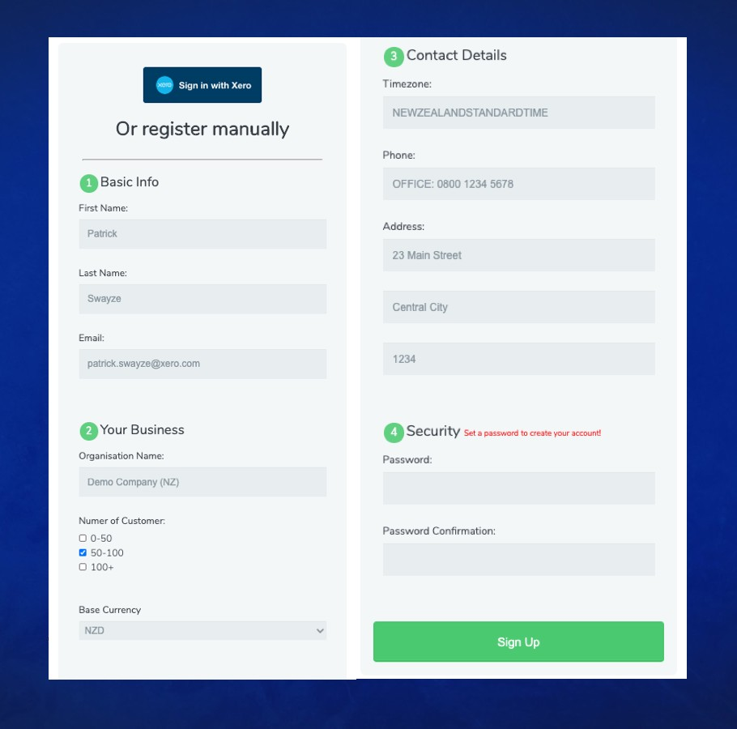

# Signup with Xero - "SSO Light"

This is a basic application showing how to use OAuth2.0 and OpenID Connect flow to pre-populate a signup form.

The goal is to use Xero’s API to authorize an existing Xero customer using the supported OpenID Connect scopes which will return back the id_token to an application. Instead of dropping an interested Xero customer on a blank landing page where they have to re-enter their details and submit a signup form, they land in the context of the app partner’s existing sales process complete with the existing data contained in the id_token such as email, first_name, and last_name.
> https://devblog.xero.com/how-to-leverage-openid-connect-to-boost-signup-conversion-20b952cc457a

Full documentation on SSU and SSO:
* [Sign Up with Xero](https://developer.xero.com/documentation/oauth2/sign-up)
* [Sign In with Xero](https://developer.xero.com/documentation/oauth2/sign-in)

**This repo uses the [xero-ruby](https://github.com/XeroAPI/xero-ruby) sdk**

> Interested in joining the Xero Partner program?
> https://developer.xero.com/partner/app-partner


### Hosted Demo
> https://xero-sso-form.herokuapp.com

----

Full **Single Sign On** does not always work with an app's infrastructure or their on-boarding process might start with booking a demo, instead of immediately starting a free-trial. Because Xero leverages OA2 and OpenID Connect we can use the decoded `id_token` to prefill user details, and the `access_token` to make a few API calls the pre-populate dynamic signup details.



Using just a few lines of code, we can pre-populate the following fields from Xero's API which makes a great user experience versus dropping someone on a blank landing page.

* given_name
* family_name
* email
* org_name
* contacts_count
* currency
* timezone
* street
* city
* postal_code
* phone
* password


# Getting Started
```bash
ruby -v
ruby 2.7.0
```

https://developer.xero.com/myapps/

Clone app and rename `sample.env` to `.env` and replace with the **4 required parameters**
```bash
$ git clone git@github.com:XeroAPI/xero-ruby-oauth2-starter.git
$ cd xero-ruby-oauth2-starter/
$ mv sample.env .env
```
Replace `CLIENT_ID`, `CLIENT_SECRET` & `REDIRECT_URI` with your unique params.

```bash
$ bundle install
$ bundle exec ruby xero_app.rb
```

> Visit `http://localhost:4567/` and start exploring the code in your editor of choice 🥳

----

Checkout `xero_app.rb` for all the sample code you need to learn hwo to use the `id_token` for pre-populating a demo or signup form via.
